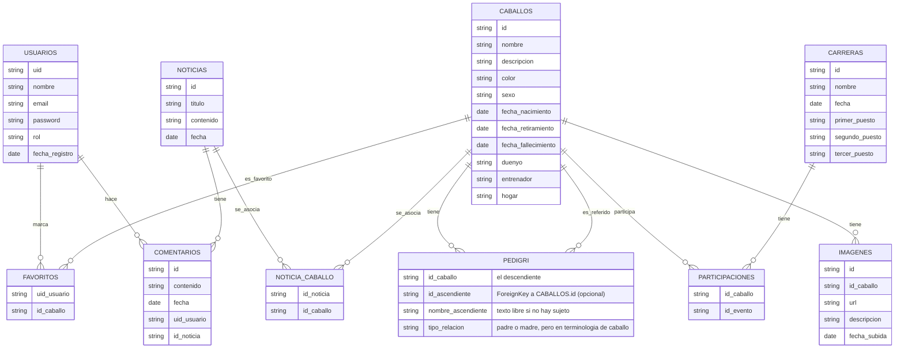

# Aplicación web de *Caballos de carreras*

Se pretende desarrollar una aplicación para permitir a fans del deporte de *carreras de caballos* informarse sobre sus caballos favoritos y sobre carreras interesantes que hayan ocurrido recientemente. 

Se tendrá una sección para ver los datos de los caballos y otra sección estilo blog con noticias de carreras recientes, sobretodo aquellas en las que hayan participado los caballos listados.
También se tendrá un pequeño apartado con enlaces a unas organizaciones que se encargan del cuidado de caballos retirados y que aceptan donaciones (una de España, otra de EEUU y otra de Japón).

Los usuarios en general podrán ver los caballos, las noticias de carreras (sobre las que podrán comentar) y los enlaces a tres organizaciones.
Los administradores podrán crear/editar/borrar las páginas y borrar comentarios en noticias, además de las acciones de usuario normal.

## Parte 1: Requerimientos 

Los casos de uso básicos son:

* Un usuario sin estar autentificado debe poder ver los datos básicos de la lista de caballos más populares en el sitio
* Un usuario sin estar autentificado debe poder buscar un caballo por nombre o por estado (activo/retirado/fallecido).
* Un usuario sin estar autentificado debe poder ver todos los datos de un caballo, incluyendo enlaces a noticias relacionadas
* Un usuario debe poder hacer login y logout en la aplicación
* Un usuario debe poder darse de alta, editar su perfil y darse de baja
* Un usuario autentificado debe poder añadir un caballo a su lista de favoritos y recibir notificaciones cuando haya noticias suyas.
* Un usuario autentificado debe poder añadir un comentario en la sección de comentarios de una noticia y posteriormente poder editarlo.
* Un usuario autentificado debe poder responder a un comentario de otro usuario en la sección de comentarios de una noticia.
* El usuario administrador autentificado podrá gestionar (crear, ver, modificar y borrar) todas las páginas.
* El usuario administrador autentificado podrá eliminar comentarios de la sección de comentarios de una noticia.

## Parte 2: Modelo de datos 

